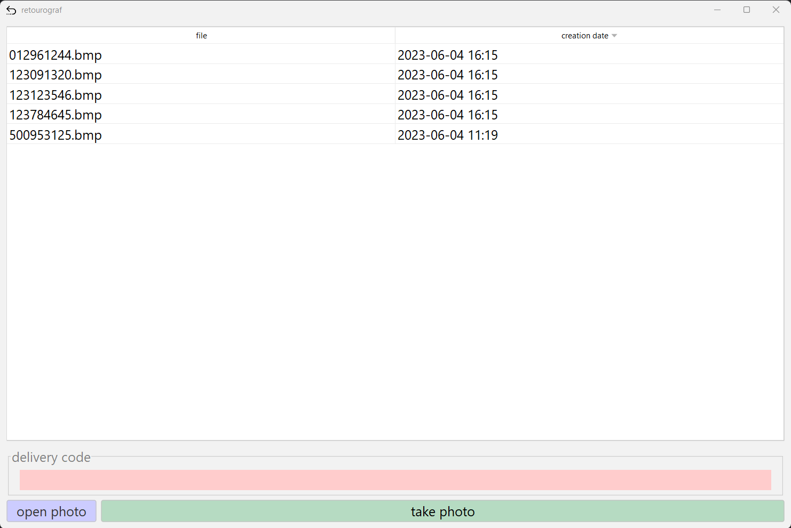

# retourograf

retourograf is a simple graphical user interface (GUI) application that enables you to capture photos using a [Blink Camera System](https://github.com/fronzbot/blinkpy) for personal use. This
application uses Java and a Python script to interact with a Blink API provided by [fronzbot](https://github.com/fronzbot).



## Features

- Enter a photo title using an easy-to-use GUI.
- Automatically send requests to the Blink API to capture and download photos.
- Exact file name matching to prevent duplicate file names.
- Display downloaded photos in a within the set folder.

## Technology Stack

- Java 17
- Gradle 8
- Swing for GUI
- [JFormDesigner 8](https://www.formdev.com/jformdesigner/) for GUI Design
- [Blinkpy](https://github.com/fronzbot/blinkpy) as the Blink Camera Python API
- Python for the API interaction script

## Dependencies

- [MigLayout](https://github.com/mikaelgrev/miglayout) for flexible layout control
- [Apache Commons Lang](https://commons.apache.org/proper/commons-lang/) for additional functionality
- [FlatLaf](https://github.com/JFormDesigner/FlatLaf) for modern flat look and feel

## Usage

1. Clone the repository: `git clone https://github.com/soeguet/PhotoCaptureGUI.git`.
2. Open the project in your favorite IDE.
3. Optional: set picture folder path and credentials in python script (you will need to set up your venv)
4. Start the project with ```gradle run``` in the terminal.
5. Enter a title for your photo in the text field and click "Take Photo" (will only work if step 3 was set up).

The photo will be captured and downloaded into the predefined folder. The application will then display the photo.

## Disclaimer

Since this program is used by me every day, I went with my personal naming preferences. Feel free to adjust it to your needs.
Furthermore, I did not provide a file path nor credentials for the python script (obviously), therefore the GUI will display the content of your project folder and it will not run the python script.
The file path can be provided in the GuiImpl class and the script is located in ```src/main/java/resources/scripts/main.py```.

## Contributing

Contributions, issues, and feature requests are welcome! Feel free to check [issues page](https://github.com/soeguet/retourograf/issues).

## License

[MIT](https://choosealicense.com/licenses/mit/)
